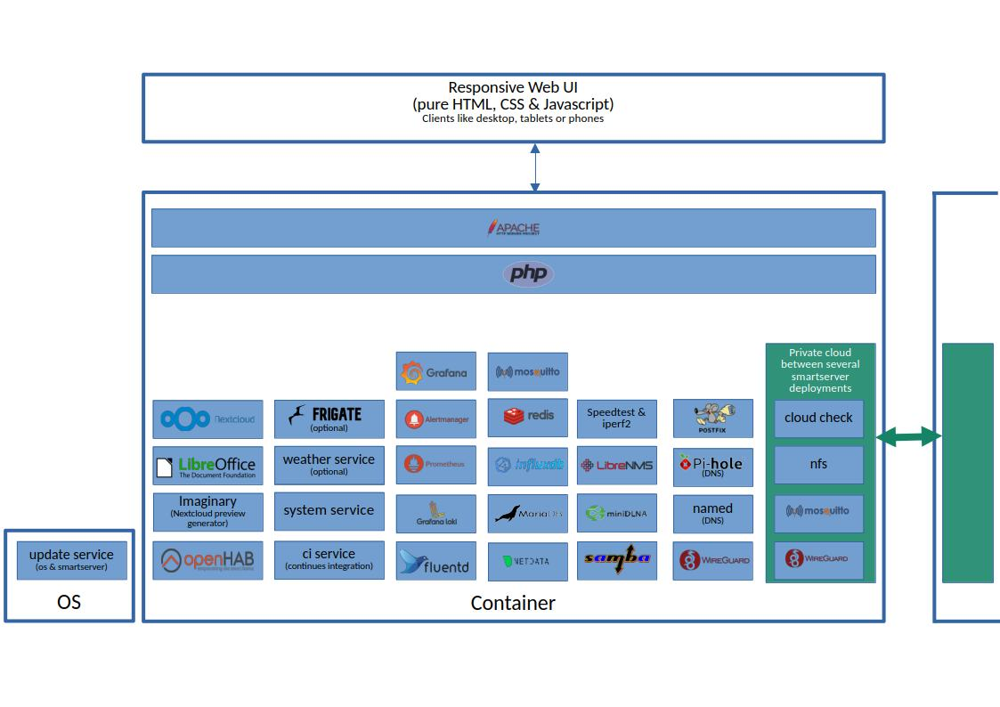
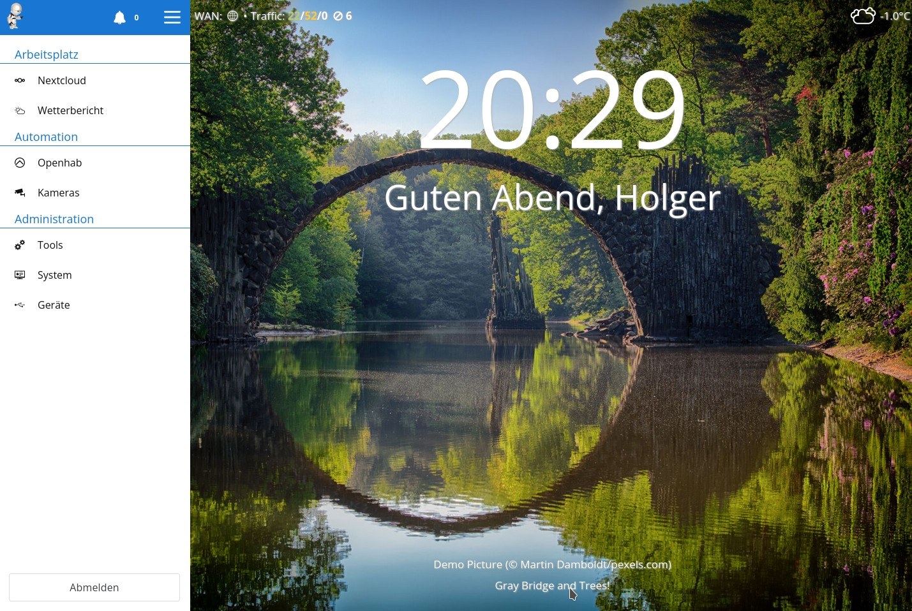

# Smartserver

This project contains my complete automated IoT Server setup, deployable on opensuse, almalinux (rhel) and ubuntu.

For a detailed overview of the installed software and how it can be customized, see the following

* the main deployment [server.yml](https://github.com/HolgerHees/smartserver/blob/master/server.yml) file
* or the default [configuration options](https://github.com/HolgerHees/smartserver/blob/master/config/default.yml)
* or to see, how it is used, visit [https://intranet-of-things.com/](https://intranet-of-things.com/)

For a detailed description about the main features and a lot more, check [the wiki](https://github.com/HolgerHees/smartserver/wiki)

## Demo setup

To try this smartserver deployment, just 3 steps are needed. Install [Vagrant](https://www.vagrantup.com/) and [VirtualBox](https://www.virtualbox.org/) and run the deployment script.

A detailed explaination can be found in the [How to start](https://github.com/HolgerHees/smartserver/wiki/Setup) wiki section

## Technology & Service stack

After running ansible, the following technology & service stack will be deployed.

In addition to well known services, some custom additions are deployed too.

1. a responsive Web UI, written in pure HTML, CSS and Javascript is deployed too. It is used to embedd webUI's from other services in a central place. It supports "user" and "admin" roles to show only nessecarry menu points to your family members.

2. "Private cloud" is a complete isolated network spanned through wireguard between several smartserver deployments to share backup folder, sensor messurements or other data with friends.

3. "Update service" gives you a webui to handle and manage your os updates and smartserver changes and getting notified if there are new updates available

4. "CI service" is running your smartserver deployment on suse, alma and ubuntu virtual boxes after every commit to vertify that your changes works fine

5. "Weather service" is fetching weather data from a public provider and make it available for my smarthome logic

6. "System Service" is the most complex service. It provides
    - A network scanner which builds and visualizes a network/cable structure of your home network. Data are comming from snmp aware router/switches, fritzbox devices and openwrt powered devices.

    

    - A network state checker, who is permanently monitoring your wan connection state and speed. The reachability of your cloud peers. The reachability of your backup folder etc.

    

    - A netflow and log analyser, who is able to block IP's automatically if they contact your server in a bad way. This includes also traffic like SYN requests which are normally not visible in log files.

    
