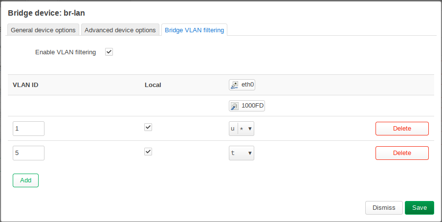
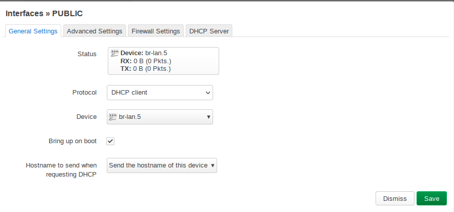
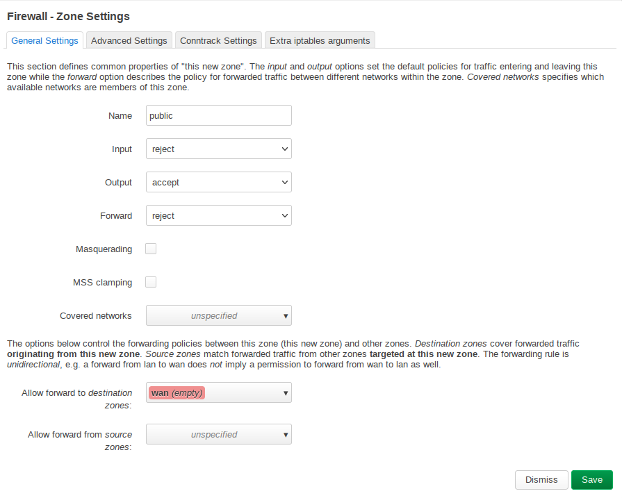
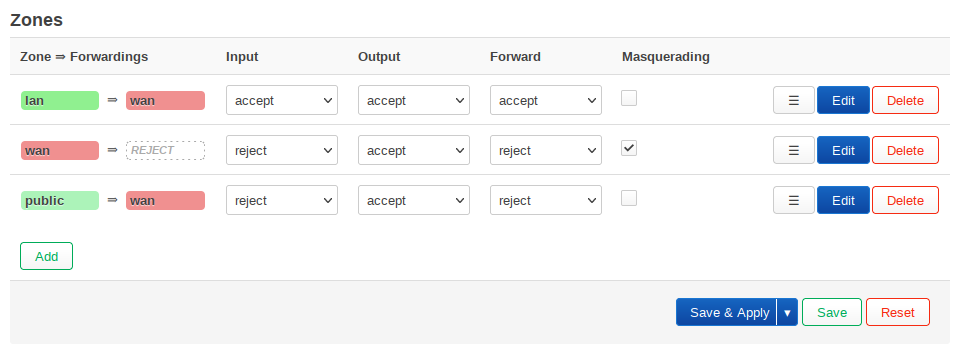

# 1. Preparations

    Set root password and switch lan interface to dhcp
    
    Set hostname & timezone

# 2. Network

    Setup vlan together with lan and public interface

# 2.1 Configure "Bridge VLAN filtering" on network device "br-lan"

- VLAN ID 1 has "Egress untagged and Primary VLAN ID" enabled
- VLAN ID 5 has "Tagged" enabled




# 2.2 Change your Interface

Now change your Interface "LAN" to use the new device "br-lan.1"


In addition, create a new interface "PUBLIC" which uses the new device "br-lan.5"



And finally disable dhcp server on each interfaces


# 3. Firewall & DHCP

    Setup public firewall zone, if needed. If you run your AP just as a dump AP you can disable firewall, dhcp and masquerading by addint the following snipped to /etc/rc.local
    
```
for i in firewall dnsmasq odhcpd; do
  if /etc/init.d/"$i" enabled; then
    /etc/init.d/"$i" disable
    /etc/init.d/"$i" stop
  fi
done
```

 

# 4. Backup

### 4.1 Common

    /etc/shadow => /smartserver/config/{config}/vault/openwrt/shared/etc/shadow
    /etc/config/network => /smartserver/config/{config}/vault/openwrt/shared/etc/config/network
    
    /etc/config/system => /smartserver/config/{config}/vault/openwrt/{ip}/etc/config/system

### 4.1 Firewall & DHCP specific

    /etc/config/rc.local => /smartserver/config/{config}/vault/openwrt/shared/etc/rc.local
    
    or

    /etc/config/dhcp => /smartserver/config/{config}/vault/openwrt/{ip}/etc/dhcp
    /etc/config/firewall => /smartserver/config/{config}/vault/openwrt/{ip}/etc/config/firewall
    
# 5. Run ansible

    ansible-playbook -i config/{config}}/server_local.ini --ask-vault-pass --tags="openwrt" server.yml
