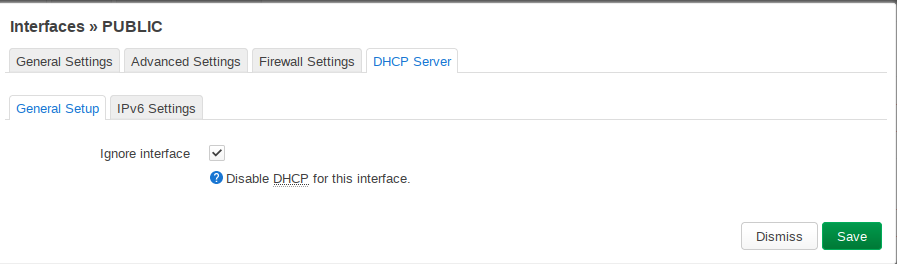

# 1. Preparations

    Set root password and switch lan interface to dhcp
    
    Set hostname & timezone

# 2. Firewall

    Setup public firewall zone

 

# 3. Network & DHCP Server

    Setup vlan together with lan and public interface

  

    Make also sure that dhcp server is disabled on all interfaces

# 4. Backup

    /etc/shadow => /smartserver/config/{config}/vault/openwrt/{ip}/etc/shadow
    /etc/config/system => /smartserver/config/{config}/vault/openwrt/{ip}/etc/config/system
    /etc/config/firewall => /smartserver/config/{config}/vault/openwrt/{ip}/etc/config/firewall
    /etc/config/network => /smartserver/config/{config}/vault/openwrt/{ip}/etc/network
    /etc/config/dhcp => /smartserver/config/{config}/vault/openwrt/{ip}/etc/network

# 5. Run ansible

    ansible-playbook -i config/{config}}/server_local.ini --ask-vault-pass --tags="openwrt" server.yml
